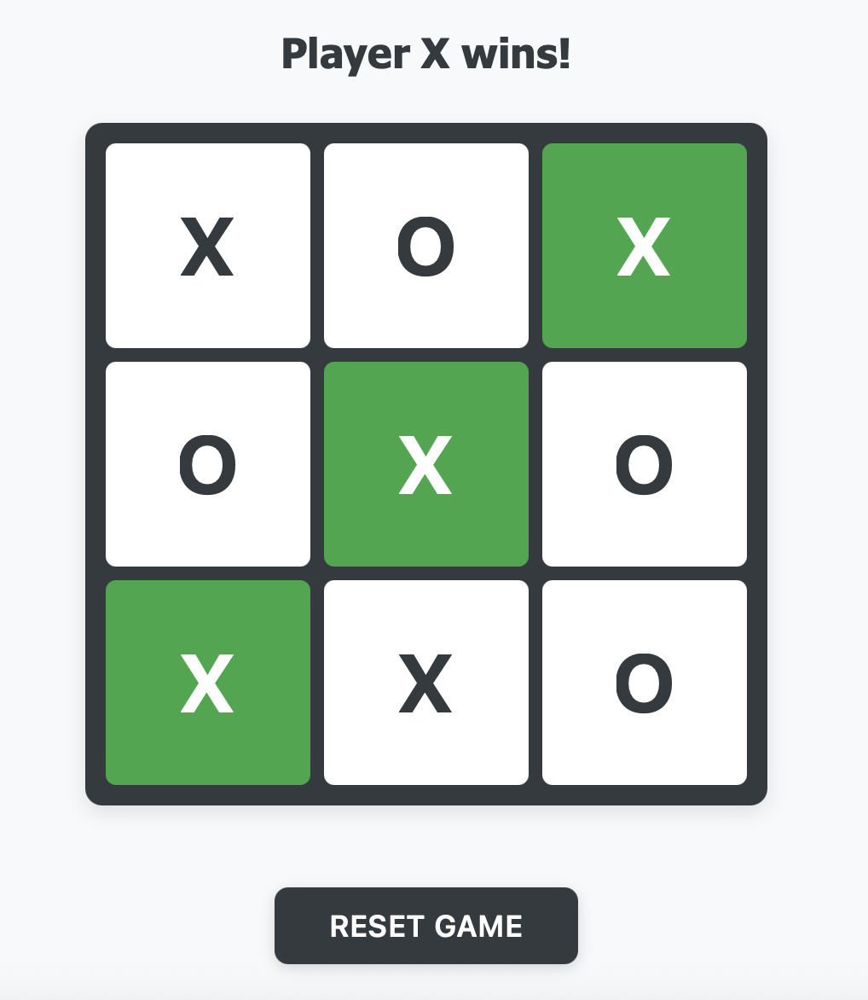

# React Tic Tac Toe

A simple and interactive Tic Tac Toe game built with React, TypeScript, and SCSS, following the principles of Test-Driven Development (TDD).



## Features

- Classic 3x3 Tic Tac Toe gameplay
- Detects all winning combinations
- Recognizes draw scenarios
- Allows game reset at any time
- Responsive layout for various screen sizes
- Accessible and keyboard-friendly interface

## Development Approach

This project was developed using a Test-Driven Development (TDD) workflow:

1. Wrote tests before implementing each feature
2. Built logic to make tests pass
3. Refactored code while keeping tests green
4. Repeated the process for all functionalities

## Testing

The test suite covers key aspects of the game, including:

- Rendering of the game board and components
- Alternating player turns (X and O)
- Validation of all 8 win conditions
- Detection of draw scenarios
- Prevention of invalid moves (e.g., clicking the same cell twice)
- Resetting the game state

## Technologies Used

- **React 18** with functional components and Hooks
- **TypeScript** for type-safe development
- **SCSS Modules** for modular and scoped styling
- **Vite** for fast development and build setup
- **Testing Library** for writing unit and integration tests

## Getting Started

To run the project locally:

```bash
git clone https://github.com/mahmoudahmedweb/Tic-Tac-Toe.git
cd react-tic-tac-toe
npm install
npm run dev
```
